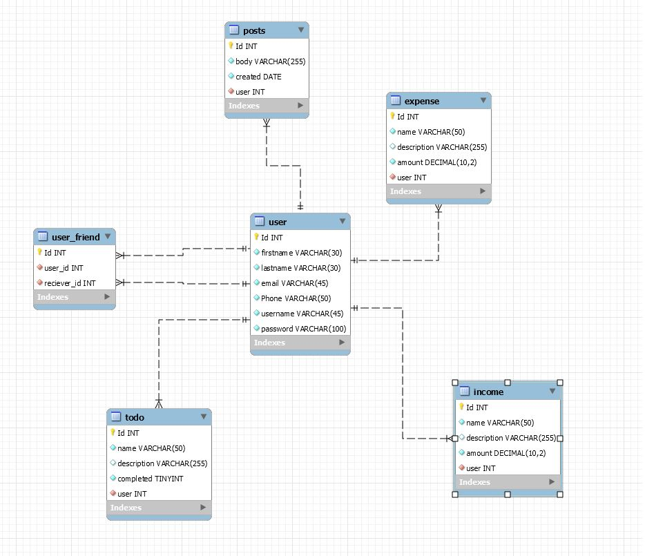
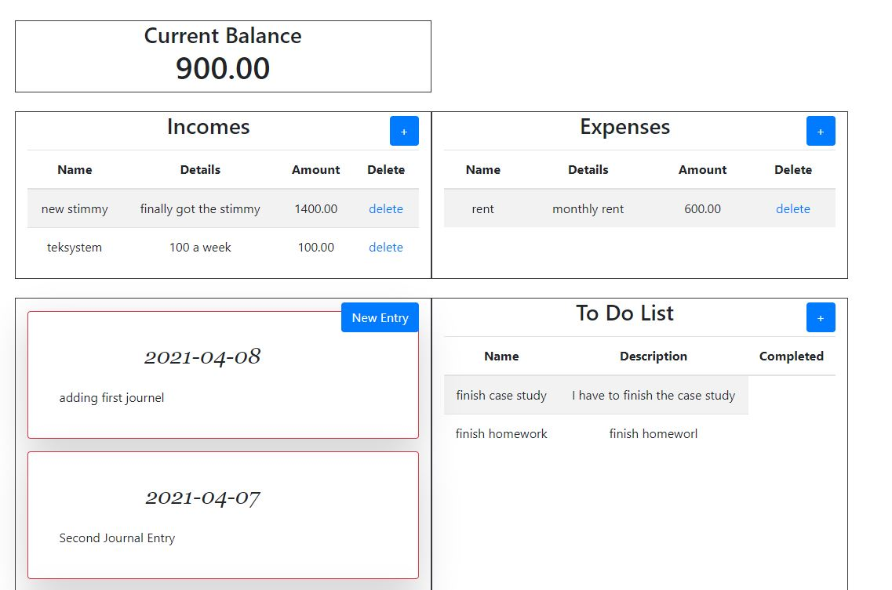

# TEKsystems Case Study

<table>
<tr>
<td>
 This is a full stack web application assigned by TEKGlobal as a case study.
</td>
</tr>
</table>

# User Stories
* As an application user I want to be able to create my own profile 
* As an application user I want the application to add sources of my incomes  
* As an application user I want the application to add sources of my expenses 
* As an application user I want the application to be able to delete incomes
* As an application user I want the application to be able to delete expenses 
* As an application user I want the application to display my current balance
* As an application user I want to be able to create to a to-do list
* As an application user I want the be able to add and delete tasks from to-do lists
* As an application user I want to be able to write journel entries 
* As an application user I want the application to record the date of the journal entry
* As an application user I want to be able to add other users as friends
* As an application user I want only my journel entries to display to my friends

## DB-SCHEMA

### Technologies Used (references at the bottom)
* Java 8
* Maven
* Spring Boot DevTools
* Spring Data JPA
* Spring Web Services
* Spring Boot Maven Plugin
* SOAP web service
* Accessing Data with JPA
* Accessing data with MySQL
* Spring boot thymeleaf
* HTML
* CSS
* JavaScript

## User home page
<table>
<tr>
<td>
Version 1.0 of full Crud functionality of application
</td>
</tr>
</table>

### Reference Documentation
For further reference, please consider the following sections:

* [Official Apache Maven documentation](https://maven.apache.org/guides/index.html)
* [Spring Boot Maven Plugin Reference Guide](https://docs.spring.io/spring-boot/docs/2.4.3/maven-plugin/reference/html/)
* [Create an OCI image](https://docs.spring.io/spring-boot/docs/2.4.3/maven-plugin/reference/html/#build-image)
* [Spring Boot DevTools](https://docs.spring.io/spring-boot/docs/2.4.3/reference/htmlsingle/#using-boot-devtools)
* [Spring Web Services](https://docs.spring.io/spring-boot/docs/2.4.3/reference/htmlsingle/#boot-features-webservices)
* [Spring Data JPA](https://docs.spring.io/spring-boot/docs/2.4.3/reference/htmlsingle/#boot-features-jpa-and-spring-data)

### Guides
The following guides illustrate how to use some features concretely:

* [Producing a SOAP web service](https://spring.io/guides/gs/producing-web-service/)
* [Securing a Web Application](https://spring.io/guides/gs/securing-web/)
* [Spring Boot and OAuth2](https://spring.io/guides/tutorials/spring-boot-oauth2/)
* [Authenticating a User with LDAP](https://spring.io/guides/gs/authenticating-ldap/)
* [Accessing Data with JPA](https://spring.io/guides/gs/accessing-data-jpa/)
* [Accessing data with MySQL](https://spring.io/guides/gs/accessing-data-mysql/)
